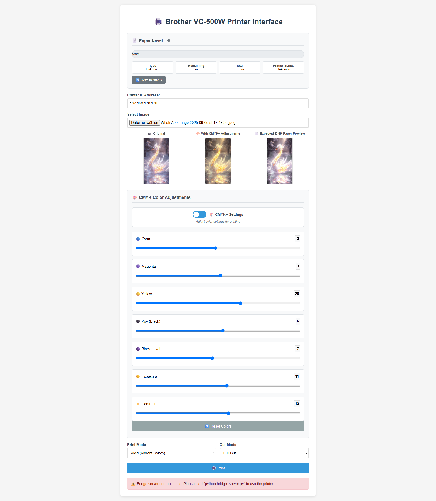

# Brother VC-500W Color Fix - Web Interface

A modern web-based color correction and printing interface for the Brother VC-500W label printer, featuring advanced CMYK adjustments, real-time preview, and ZINK paper optimization.

## ✨ Features

### 🎨 Advanced Color Control
- **CMYK Adjustments**: Fine-tune Cyan, Magenta, Yellow, and Key (Black) channels individually
- **Exposure Control**: Adjust overall brightness like camera exposure settings
- **Black Level**: Lift or lower shadow details specifically
- **Contrast**: Enhance or reduce contrast around midtone values
- **Real-time Preview**: See adjustments instantly with three preview modes

### 📄 ZINK Paper Optimization
- **Expected ZINK Paper Preview**: Specialized preview showing how colors will appear on ZINK paper
- **Automatic ZINK Corrections**: Pre-configured adjustments optimized for ZINK paper characteristics
- **Separate Processing**: Different color profiles for regular vs ZINK paper output

### 🖨️ Smart Printing
- **Automatic Format Conversion**: Converts any image format to JPEG automatically
- **Paper Level Monitoring**: Real-time tape remaining display with color-coded indicators
- **Print Mode Selection**: Choose between Vivid and Normal print modes
- **Cut Options**: Full cut, half cut, or no cut after printing
- **Error Handling**: Comprehensive error messages and status updates

### 💾 User Experience
- **Settings Persistence**: All adjustments saved automatically using localStorage
- **Responsive Design**: Works on desktop, tablet, and mobile devices
- **Modern UI**: Clean, intuitive interface with emoji indicators
- **Reset Function**: One-click reset to default values

## 🚀 Quick Start

### Prerequisites
- Python 3.x installed on your system
- Brother VC-500W printer connected to your network
- Modern web browser (Chrome, Firefox, Safari, Edge)

### Installation

1. **Clone or download this repository**
   ```bash
   git clone https://github.com/Tadelsucht/VC500W-ColorFix.git
   cd C-500W-Color-Fix
   ```

2. **Install Python dependencies**
   ```bash
   pip install -r requirements.txt
   ```

3. **Start the bridge server**
   ```bash
   python bridge_server.py
   ```

4. **Open the web interface**
   - Open `web_interface.html` in your web browser
   - Or serve it locally: `python -m http.server 8000` and visit `http://localhost:8000`

### Basic Usage

1. **Configure Printer IP**: Enter your Brother VC-500W's IP address
2. **Select Image**: Choose any image file (JPEG, PNG, GIF, etc.)
3. **Adjust Colors**: Use the CMYK sliders to fine-tune colors
4. **Preview Results**: Compare Original, Adjusted, and ZINK previews
5. **Print**: Click the print button to send to your printer

## 🎛️ Color Adjustment Guide

### CMYK Controls
- **🔵 Cyan**: Adjust blue-green tones (-100 to +100)
- **🟣 Magenta**: Adjust red-purple tones (-100 to +100)  
- **🟡 Yellow**: Adjust yellow tones (-100 to +100)
- **⚫ Key (Black)**: Adjust black/shadow density (-100 to +100)

### Tone Controls
- **🌑 Black Level**: Lift shadows (positive) or deepen them (negative)
- **☀️ Exposure**: Overall brightness adjustment like camera exposure
- **🔆 Contrast**: Enhance (positive) or reduce (negative) contrast around midtones

## 🏗️ Technical Architecture

### Components
- **Web Interface** (`web_interface.html`): Modern HTML5/CSS3/JavaScript frontend
- **Bridge Server** (`bridge_server.py`): Python HTTP server that communicates with printer
- **Labelprinter Module**: Core printing logic and Brother VC-500W communication

### Image Processing Pipeline
1. **Input**: Any image format accepted
2. **Conversion**: Automatic JPEG conversion if needed
3. **Color Processing**: Apply CMYK, exposure, black level, and contrast adjustments
4. **Preview Generation**: Real-time canvas-based image processing
5. **Print Output**: Optimized JPEG sent to printer via TCP

### Network Communication
```
Browser → HTTP/FormData → Bridge Server → TCP/9100 → Brother VC-500W
```

## 📋 Requirements

### System Requirements
- **Operating System**: Windows, macOS, or Linux
- **Network**: Local network connection to Brother VC-500W

### Python Dependencies
- `Pillow` - Image processing
- `http.server` - Built-in HTTP server
- Standard library modules for TCP communication

## 🔧 Configuration

### Printer Setup
1. Ensure your Brother VC-500W is connected to the same network
2. Find the printer's IP address (check printer display or router admin panel)
3. Test connectivity: `ping <printer-ip>`

### Firewall Settings
The bridge server runs on port 8080. Ensure this port is accessible:
- Windows: Allow Python through Windows Defender Firewall
- macOS: Allow incoming connections for Python
- Linux: Check iptables rules if needed

## 🐛 Troubleshooting

### Common Issues

**Bridge server not reachable**
- Ensure Python is installed and in PATH
- Check if port 8080 is available
- Try running bridge server as administrator

**Printer not responding**
- Verify printer IP address is correct
- Check network connectivity to printer
- Ensure printer is powered on and online

**Images not loading**
- Check browser console for JavaScript errors
- Ensure localStorage is enabled in browser
- Try different image formats

**Color corrections not working**
- Verify all sliders are responding in UI
- Check if preview updates when sliders change
- Clear browser cache and reload

## 📝 License

This project is licensed under the GNU Affero General Public License v3.0 (AGPLv3).

See [LICENSE](LICENSE) file for full license text.

### Code Style
- HTML: Use semantic markup and proper indentation
- CSS: Follow BEM methodology where applicable
- JavaScript: Use modern ES6+ features, clear variable names
- Python: Follow PEP 8 style guidelines

## 🙏 Acknowledgments

- Original labelprinter module by [Andrea Micheloni](https://m7i.org/projects/labelprinter-linux-python-for-vc-500w/)
- labelprinter-vc500w by [lenchan139](https://gitlab.com/lenchan139/labelprinter-vc500w/-/tree/master?ref_type=heads)
- Brother for the VC-500W printer

## Screenshot


---

**Note**: This is an unofficial tool and is not affiliated with or endorsed by Brother Industries, Ltd.
